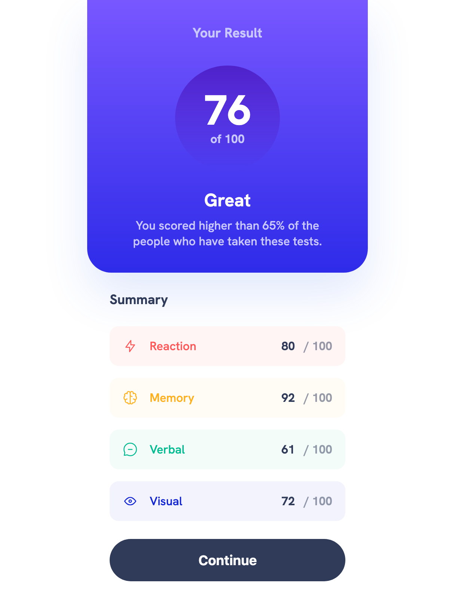
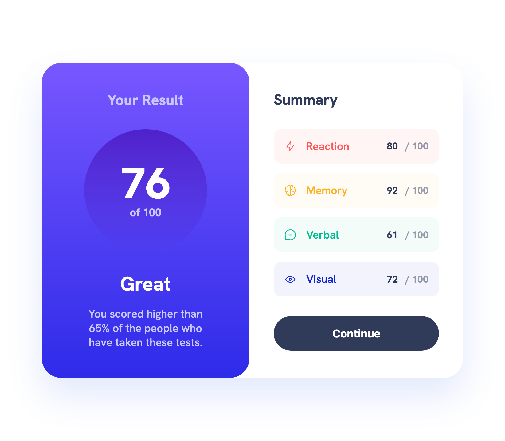
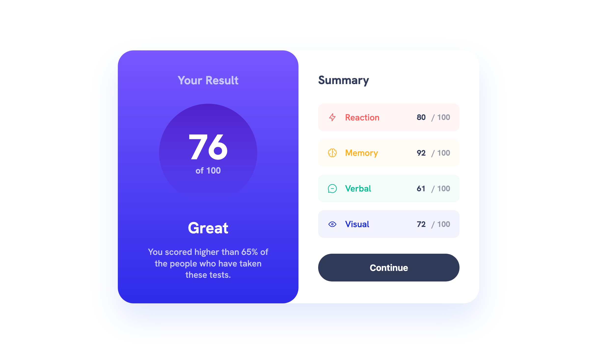

# Frontend Mentor - Results summary component solution

This is a solution to the [Results summary component challenge on Frontend Mentor](https://www.frontendmentor.io/challenges/results-summary-component-CE_K6s0maV). Frontend Mentor challenges help you improve your coding skills by building realistic projects.

## Table of contents

- [Overview](#overview)
  - [The challenge](#the-challenge)
  - [Screenshot](#screenshot)
  - [Links](#links)
- [My process](#my-process)
  - [Built with](#built-with)
  - [What I learned](#what-i-learned)
  - [Continued development](#continued-development)
  - [Useful resources](#useful-resources)
  - [AI Collaboration](#ai-collaboration)
- [Author](#author)

## Overview

### The challenge

Users should be able to:

- View the optimal layout for the interface depending on their device's screen size
- See hover and focus states for all interactive elements on the page
- **Bonus**: Use the local JSON data to dynamically populate the content

### Screenshot





### Links

- Solution URL: [Add solution URL here](https://your-solution-url.com)
- Live Site URL: [Add live site URL here](https://your-live-site-url.com)

## My process

### Built with

- Semantic HTML5 markup
- CSS custom properties
- Flexbox
- JavaScript
- Mobile-first workflow

### What I learned

I ran into issues when switching my layout from column to row using flexbox. In the column layout, everything looked fine because the flex items automatically stretched to the full width of the container. Not so in row.

I initially tried letting the content define the width and using max-width, but it didn't work. What worked was explicitly setting the width on both items with flex-basis:

```css
.card__header {
  padding: 2.813rem 3.375rem;
  flex: 0 0 50%;
}

.card__main {
  padding: 2.781rem 2.5rem;
  flex: 0 0 50%;
}
```

This made each section take half of the container.

### Continued development

I need to learn more about how to make my site responsive, as well as practice using Flexbox.

### Useful resources

- [Great blog about CSS and JS](https://www.joshwcomeau.com/css/interactive-guide-to-flexbox/) - This helped me with my Flexbox content.

### AI Collaboration

I use ChatGPT as a sort of a mentor. I don't use to generate code for me. I use to debug only when I've worked on a problem for a while, and I instruct it to give me hints, make me think about what the answer might be instead of just straight out solving the problem for me.

## Author

- Frontend Mentor - [@Kristina2025](https://www.frontendmentor.io/profile/Kristina2025)
